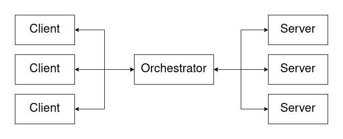

# IASC

## Ejecución de la solución en Kubernetes

La solución se puede ejecutar en Kubernetes, las pruebas se realizaron utilizando Minikube.

Se requiere tener instalado:

* [Kubectl](https://kubernetes.io/es/docs/tasks/tools/)
* [Minikube](https://minikube.sigs.k8s.io/docs/start/)

La creación de la imagen se realiza utiliznado el archivo `Dockerfile`.
La creación de los servicios, deployments y pods en Kubernetes estan enteramente definidos en el directorio `kube`.

Una vez levantada la solución en Kubernetes la arquitectura se verá así:



### Creación de la imagen

El proyecto se genera enteramente dentro de una única imagen de Docker, esto en un ambiente productivo no es recomendable, deberíamos tener un Dockerfile por cada servicio y construirlos de manera separada. Lo hacemos de esta manera debido a que era más rapido y simple dado lo pequeño de la solución.

El Dockerfile construye la imagen que espera una variable de entorno apuntando al path del js a ejecutar.

La imagen debe crearse luego de iniciar minikube ejecutando los siguientes comandos:

```bash
eval $(minikube docker-env)
docker build . -t iasc-tp-grupo-3
```

### Ejecución utilizando Kubectl

En Kubernetes se creará para cada servicio lo siguiente:

* Server
  * Se crea un deployment con un replica set de 3, no es necesario crear un servicio dado que los Pods de Server acceden al orquestador y luego se comunican via Sockets.

* Client
  * Se crea un deployment con un replica set de 3, se crea un service llamado client y se debe ejecutar el siguiente comando para ser accesible desde la computadora local
 ```bash
minikube service client --url
```

* Orchestretor
  * Se crea un deployment con un replica set de 1, se crea un servicio llamado orchestrator con el type ClusterIp para ser accedido por el resto de los pods.

Para levantar todos los servicios se debe ejecutar:

 ```bash
kubectl apply -f kube
```

## FrontEnd

## TL;DR

Para levantar la solución teniendo previamente instalado Kubernetes y Minikube los comandos son los siguientes para linux:

 ```bash
minikube start
eval $(minikube docker-env)
docker build . -t iasc-tp-grupo-3
kubectl apply -f kube
minikube service client --url
```

Para macOS:
 ```bash
minikube start --driver=hyperkit
eval $(minikube docker-env)
docker build . -t iasc-tp-grupo-3
kubectl apply -f kube
minikube service client --url
```
